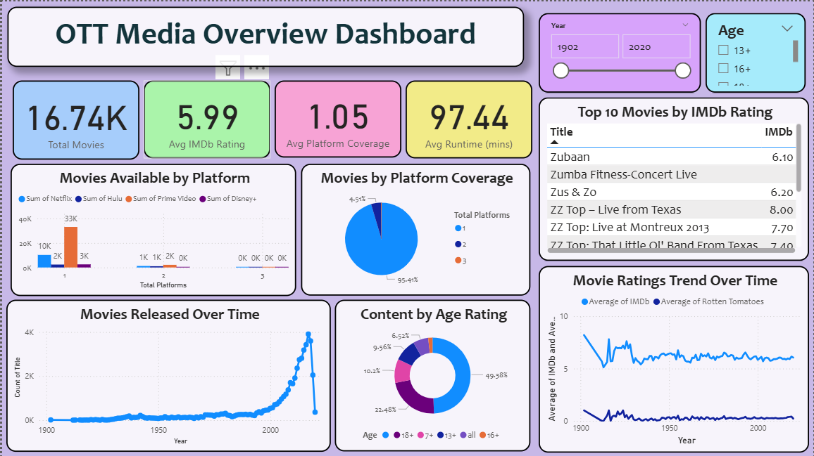
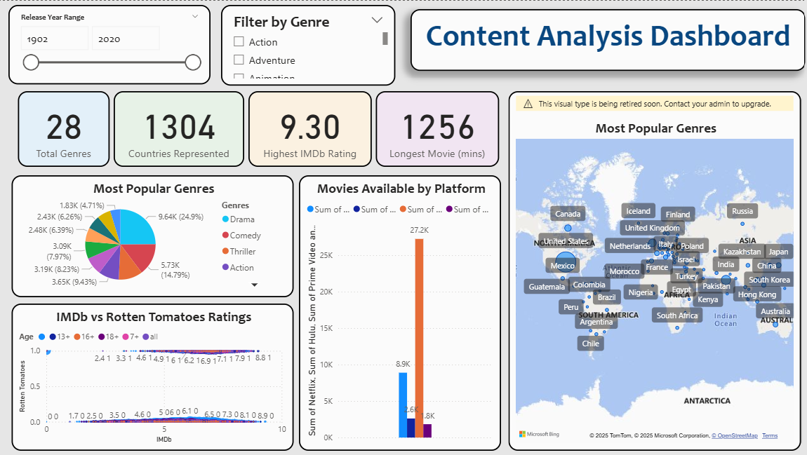

# PowerBI-OTT-Media-Dashboard
# OTT Media Dashboard - Power BI Analytics

This Power BI project analyzes the Over-The-Top (OTT) media streaming landscape using real-world data from movies available across major streaming platforms. The dashboard provides comprehensive insights into content distribution, quality metrics, platform strategies, and global content trends for data-driven decision making in the streaming industry.

## Objective

- **Content Analysis**: Understanding genre preferences and distribution patterns
- **Quality Assessment**: Analyzing IMDb and Rotten Tomatoes ratings correlation  
- **Platform Intelligence**: Examining content availability across Netflix, Hulu, Prime Video, and Disney+
- **Geographic Distribution**: Mapping global content production and availability
- **Temporal Trends**: Identifying patterns in movie releases and quality evolution over time

## Dataset

**Source**: [MoviesOnStreamingPlatforms.csv](https://github.com/prasertcbs/basic-dataset/blob/master/MoviesOnStreamingPlatforms.csv)

**Dataset Size**: 16,744 movies spanning from 1902 to 2020

| Field | Description |
|-------|-------------|
| Title | Movie names for identification |
| Year | Release years (1902-2020) |
| Age | Content ratings (13+, 16+, 18+, etc.) |
| IMDb | Rating scores (0-10 scale) |
| Rotten Tomatoes | Critic scores (0-100%) |
| Platforms | Binary availability across 4 streaming services |
| Genres | Content categories (split for analysis) |
| Country | Production countries (split for analysis) |
| Directors | Creator information |
| Runtime | Movie duration in minutes |

## Dashboard Overview

This dashboard is designed as a two-page comprehensive analytics solution.

### Page 1: Overview Dashboard

**Purpose**: Executive summary and high-level KPI monitoring

**Key Metrics**:
- **Total Movies**: 16.74K
- **Average IMDb Rating**: 5.99
- **Average Platform Coverage**: 1.05
- **Average Runtime**: 97.44 minutes

**Key Visuals**:
- Platform availability comparison across Netflix, Hulu, Prime Video, Disney+
- Movie release trends over time (1902-2020)
- Top 10 highest-rated movies
- Content distribution by age rating
- Rating correlation analysis over time

### Page 2: Content Analysis Dashboard

**Purpose**: Detailed content intelligence and market analysis

**Key Metrics**:
- **Total Genres**: 28
- **Countries Represented**: 1304
- **Highest IMDb Rating**: 9.30
- **Longest Movie**: 1256 minutes

**Key Visuals**:
- Genre popularity distribution (pie chart)
- Global content distribution (world map)
- Platform content availability analysis
- IMDb vs Rotten Tomatoes rating correlation

## Data Transformation

- **Data Cleaning**: Removed null values and standardized formats
- **Column Engineering**: Created "Total Platforms" calculated field
- **Data Splitting**: Split multi-value fields (Genres, Countries, Languages) into separate rows
- **Type Optimization**: Converted data types for optimal performance
- **Quality Control**: Handled missing values and data inconsistencies

## Technical Implementation

### Power BI Features Used
- **Data Transformation**: Power Query Editor for ETL processes
- **Built-in Aggregations**: COUNT, AVERAGE, SUM, MAX, DISTINCTCOUNT (No custom DAX)
- **Interactive Filtering**: Year range and genre filtering slicers
- **Cross-Visual Filtering**: Dynamic interactions between dashboard elements
- **Professional Design**: Consistent color schemes and typography

### Visual Types
- **Cards**: KPI metrics display
- **Column Charts**: Platform comparisons and temporal analysis
- **Pie Charts**: Genre distribution analysis
- **Line Charts**: Trend analysis over time
- **Scatter Plots**: Rating correlation analysis
- **Tables**: Top movies listings
- **Maps**: Geographic content distribution

## Key Insights

- **Market Growth**: Exponential increase in movie production since 1950s
- **Platform Strategy**: Low average platform coverage (1.05) indicates content exclusivity
- **Quality Benchmarks**: Average IMDb rating of 5.99 with top movies reaching 9.30
- **Global Reach**: Content spans 1,304 countries worldwide
- **Genre Preferences**: Drama and Comedy dominate the streaming landscape

## Repository Structure

PowerBI-OTT-Media-Dashboard/
├── Data/
│   ├── MoviesOnStreamingPlatforms_updated.csv
│   └── README.md
├── docs/
│   ├── Overview-Dashboard.png
│   ├── Content-Analysis-Dashboard.png  
│   └── README.md
├── OTT_Media_Dashboard.pbix
├── ExplanationFile.docx
└── README.md

## Skills Demonstrated

- **Data Analysis**: Multi-dimensional data storytelling and visualization
- **Power BI Development**: Advanced dashboard creation without custom DAX
- **Data Transformation**: ETL processes using Power Query Editor
- **Business Intelligence**: KPI development and executive reporting
- **Design Principles**: Professional dashboard layout and user experience

## Project Files

- **Power BI Dashboard**: `OTT_Media_Dashboard.pbix`
- **Source Dataset**: `Data/MoviesOnStreamingPlatforms_updated.csv`
- **Project Documentation**: `project-explanation.docx`
- **Dashboard Screenshots**: Available in `docs/` folder

## Contact

**Author**: Smiti Badugu  
**GitHub**: [@smitibdg](https://github.com/smitibdg)

---

⭐ If you found this project useful, please consider giving it a star!
